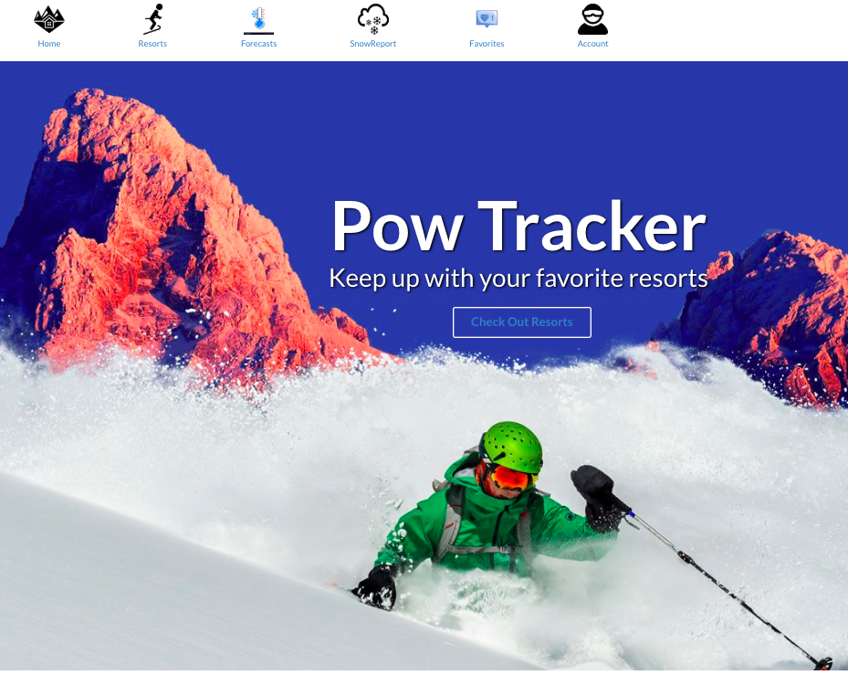

# Welcome to Pow Tracker!

## What is Pow Tracker?
This app was created for the avid skiier, or ski vacationer to check out North American stats for different ski resorts, their forecasts, and their snow reports. Imagine you are visiting Salt Lake City and want to make the most of your ski trip.. where do you go for the best conditions? You could use a couple of apps, or google your way through a couple of pages, OR you could use Pow Tracker! Pow Tracker pulls live data from the internet to provide the user with current stats on weather, snowfall, what kind of terrain a resort has, and how much each resort costs. As a visitor to the site you can access all these features, but as a user, you will be able to "favorite" a resort, forecast, and snow report and have those stats render on your personalized site. Currently, the application is only set up for one User to log in with their Google credentials, and I have created a mock profile to demonstrate this feature.

## Configuration
- Clone the repository to your computer
- Navigate to the parent folder, `back_end_final`
- Run `bundle install`
- Run `rails s` in your server to start your local server
- Open `http://localhost:3000/` in your browser

## Demo
Please click on image to access YouTube video:

## Technologies Incorporated

1. Ruby on Rails backend 

2. JavaScript and React frontend 

3. API from scraped data off of:
  https://www.skiresort.info/weather/north-america/
  https://www.skiresort.info/snow-reports/north-america/
  https://www.skiresort.info/ski-resorts/north-america/

## Database Diagram

